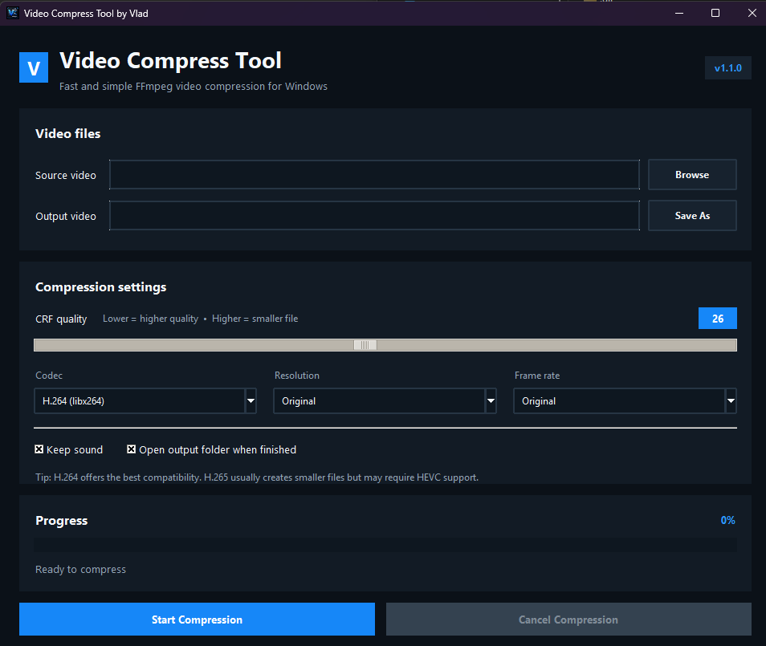

<div align="center">

# Video Compress Tool by Vlad

A modern Windows desktop application for fast and simple video compression, powered by Python, Tkinter, and FFmpeg.

[](https://github.com/vladimirrankovicqa/Video-Compress-Tool/releases/latest)
[](https://www.microsoft.com/windows)
[](https://www.python.org/)
[](https://ffmpeg.org/)

<br>



<br><br>

[Download Latest Release](https://github.com/vladimirrankovicqa/Video-Compress-Tool/releases/latest) ·
[Report an Issue](https://github.com/vladimirrankovicqa/Video-Compress-Tool/issues) ·
[View Source](https://github.com/vladimirrankovicqa/Video-Compress-Tool)

</div>

---

## Overview

**Video Compress Tool by Vlad** provides a clean graphical interface for compressing video files without requiring command-line knowledge.

The Windows executable includes FFmpeg, so end users do not need to install Python, FFmpeg, or any additional dependencies. Select a source video, choose the preferred quality and format settings, and start compression directly from the application.

## Features

- Modern dark interface with a native Windows dark title bar
- Custom dark success, information, warning, error, and confirmation dialogs
- H.264 (`libx264`) and H.265 / HEVC (`libx265`) encoding
- Adjustable CRF quality control
- Resolution presets from Full HD to 360p
- Original, 60, 30, and 25 FPS options
- Keep or remove audio
- AAC audio encoding when sound is enabled
- Real-time compression progress and elapsed video position
- Safe cancellation with automatic removal of incomplete output
- Optional automatic opening of the output folder
- Bundled FFmpeg inside the standalone Windows executable
- Custom application and taskbar icon

## Download

Download the newest Windows executable from the project's **Releases** page:

### [Download the latest release](https://github.com/vladimirrankovicqa/Video-Compress-Tool/releases/latest)

The application is portable and does not require installation.

> [!NOTE]
> Windows SmartScreen may display a warning because the executable is not digitally signed. Download releases only from this official repository.

## How to Use

1. Open **Video Compress Tool by Vlad**.
2. Select the source video.
3. Choose the output file location.
4. Adjust the CRF quality, codec, resolution, frame rate, and audio settings.
5. Select **Start Compression**.
6. Wait for the progress bar to reach 100%.

### CRF Guide

- `18–22` — high quality and larger output
- `23–27` — balanced quality and file size
- `28–35` — smaller output with stronger compression

Lower CRF values preserve more quality but create larger files.

## Supported Formats

### Input

- MP4
- MKV
- AVI
- MOV
- WMV
- FLV
- WebM

### Output

- MP4

## Running From Source

### Requirements

- Windows
- Python 3
- FFmpeg executable placed in the project root or available through the system `PATH`

Clone the repository:

```powershell
git clone https://github.com/vladimirrankovicqa/Video-Compress-Tool.git
cd Video-Compress-Tool
```

Run the application:

```powershell
python Video_Compress_Tool_by_Vlad.py
```

## Build the Windows Executable

Install PyInstaller:

```powershell
python -m pip install --upgrade pyinstaller
```

Make sure the project has this structure:

```text
Video-Compress-Tool/
├── assets/
│   └── vcompress.ico
├── images/
│   └── Tool.png
├── ffmpeg.exe
└── Video_Compress_Tool_by_Vlad.py
```

Build the standalone executable:

```powershell
python -m PyInstaller --noconfirm --clean --onefile --windowed --name "Video Compress Tool by Vlad" --icon "assets\vcompress.ico" --add-data "assets\vcompress.ico;assets" --add-binary "ffmpeg.exe;." "Video_Compress_Tool_by_Vlad.py"
```

The completed executable will be created in:

```text
dist/Video Compress Tool by Vlad.exe
```

## Technology Stack

- **Python** — application logic
- **Tkinter / ttk** — desktop interface
- **FFmpeg** — video and audio processing
- **PyInstaller** — standalone Windows packaging
- **Windows DWM API** — dark native title-bar integration

## Roadmap

- [x] Modern dark interface
- [x] Custom branded dialogs
- [x] Real-time FFmpeg progress
- [x] H.264 and H.265 support
- [x] Bundled FFmpeg
- [x] Safe cancellation
- [ ] Drag-and-drop video selection
- [ ] Batch compression
- [ ] Reusable compression presets
- [ ] Estimated output file size
- [ ] Serbian and English interface options

## Contributing

Suggestions, bug reports, and improvement ideas are welcome.

Use [GitHub Issues](https://github.com/vladimirrankovicqa/Video-Compress-Tool/issues) to report a problem or propose a feature.

## Author

Created by **Vladimir Rankovic**.

[GitHub Profile](https://github.com/vladimirrankovicqa) ·
[LinkedIn Profile](https://www.linkedin.com/in/vladimir-rankovic-363814116/)

---

<div align="center">

Made for simple, accessible, and efficient video compression.

Give the repository a star if the project is useful to you.

</div>
